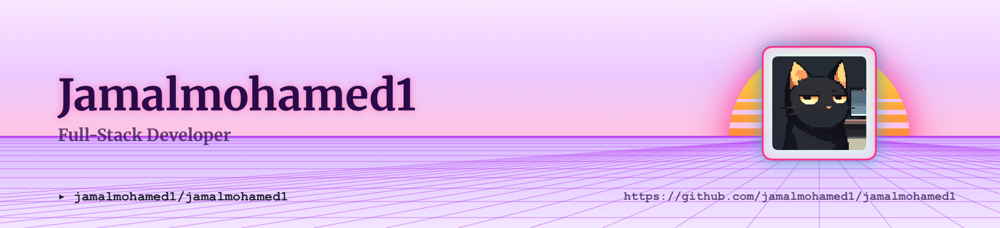

<picture>
   <source media="(prefers-color-scheme: dark)" srcset="art/header-dark.png">
   
</picture>

<h1 align="center">👋 Hey, I'm <span style="color:#EF93C4;">Jamal Mohamed T</span></h1>

<p align="center">

</p>

<p align="center">
  
  
  
</p>

<h2 align="center">🧑‍💻 About Me</h2>

I'm a **B.Tech Artificial Intelligence & Data Science** student passionate about building practical software, exploring AI/ML, and turning ideas into real-world applications.

I'm currently focused on strengthening my foundations in **Python, Data Science, AI/ML, SQL, Web Development, Cloud, and DevOps**, while building projects that help me learn by doing.

- 🎓 B.Tech Artificial Intelligence & Data Science
- 🤖 Interested in Artificial Intelligence, Machine Learning & Data Science
- 🐍 Currently improving my Python skills
- 🗄️ Learning and practicing SQL & databases
- 🌐 Familiar with HTML & CSS
- ☁️ Exploring AWS & Cloud technologies
- ⚙️ Interested in DevOps & software development
- 🚀 Building projects to improve my practical skills
- 📚 Currently learning DSA & problem solving
- 🎯 Goal: Become a strong AI/ML & Software Engineer

<h2 align="center">💻 Tech Stack</h2>

<p align="center">

</p>

**Currently Learning:** DSA · Machine Learning · Deep Learning · AWS · DevOps

<h2 align="center">🚀 Projects</h2>

**🤖 AI & Computer Vision**
Working on AI-based projects including computer vision and deepfake-related applications, exploring how machine learning can solve real-world problems.

**🗺️ Trip Assistant**
A travel assistant application concept combining maps, trip planning, shared trip rooms, Python, and MySQL to make travel planning easier.

**🏋️ Gym Workout Tracker**
Exploring the development of a workout tracking application for recording exercises, progress, and fitness routines.

<h2 align="center">📈 My Current Focus</h2>

```
Python
   ↓
DSA & Problem Solving
   ↓
SQL & Data Structures
   ↓
Machine Learning
   ↓
Deep Learning & Computer Vision
   ↓
AI Projects
   ↓
AWS + DevOps
   ↓
AI/ML & Software Engineering
```

<h2 align="center">🎯 2026 Goals</h2>

- 🚀 Build strong AI/ML projects
- 🧠 Improve DSA & problem-solving skills
- ☁️ Gain practical AWS knowledge
- ⚙️ Learn DevOps fundamentals
- 💼 Secure a strong software/AI internship
- 📂 Build a high-quality GitHub portfolio
- 🌎 Contribute to open-source projects

<h2 align="center">📈 GitHub Analytics</h2>

<p align="center">

</p>

<p align="center">

</p>

<h2 align="center">🐍 Contribution Graph</h2>

<p align="center">
  
</p>

<!--
To enable the snake animation:

1. Create a GitHub Action in this repository.
2. Use Platane/snk to generate the SVG every day.
3. Commit the generated file into:
   output/github-contribution-grid-snake.svg
-->

<h2 align="center">🤝 Let's Connect</h2>

<p align="center">
I'm always interested in AI, software development, data science, technology, and interesting projects. If you're building something cool, feel free to connect with me!
</p>

<p align="center">

<a href="https://www.linkedin.com/in/jamal-mohamed-4238ab329">

</a>

<a href="https://instagram.com/jamazhh">

</a>

<a href="mailto:jamalmohamedt@gmail.com">

</a>

</p>

<p align="center">
⭐ <i>"Learn. Build. Break. Improve. Repeat."</i>
</p>

<p align="center">

</p>
